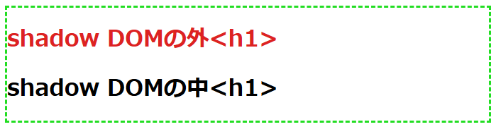

# shadow DOMでもCSSのスコープを分離できない場合がある

shadow DOMを使うとカプセル化されるため、外部CSSの影響を受けないと思っていました。
しかし **継承可能なプロパティー(colorやfont等)** はshadow DOMの内部にも適用されるため、思った通りの表示にならないことがあります


### shadow DOMのカプセル化の仕様
  * shadow DOM内部では、外部CSSのセレクターにマッチしない
  * しかし、継承プロパティについては外部のDOMからshadow DOMへ継承される


### 継承されるプロパティーと継承されないプロパティーについて
* 継承される主なプロパティ(親要素を引き継いでも問題がないもの。主にテキスト関連)
  * color, font, visibility, line-heightなど
* 継承されない主なプロパティー(見た目やレイアウトに関するスタイル)
  * text-decoration, background, border, margin, padding, width, heightなど

※つまり、shadow DOMのコンテナ要素に何らかのスタイルが継承されている場合、shadow DOM内部にも継承されフォントの色、フォントサイズなどが思った通りにならない場合がある


## 確認用html

子要素に継承されるプロパティ(color)と、継承されないプロパティー(border)を用意し、セレクタで適用する箇所を変更して動作確認を行います

```html:index.html
<!DOCTYPE HTML>
<html lang="ja">
<head>
  <meta charset="UTF-8">
  <title>shadow DOM inherit style</title>
  <style>
    /* この部分のセレクタを変更して動作を確認する */ {
      color : #d22; /* (子要素に)継承されるスタイル */
      border: medium dashed #2d2; /* 継承されないスタイル */
    }
  </style>
</head>
<body>
  <h1>shadow DOMの外&lt;h1&gt;</h1>
  <div id="host"></div>
  <script>
    // shadow DOMを作り<h1>を追加
    const host = document.querySelector("#host");
    const shadow = host.attachShadow({ mode: "open" });
    const span = document.createElement("h1");
    span.textContent = "shadow DOMの中<h1>";
    shadow.appendChild(span);
  </script>
</body>
</html>
```
* DOMは以下のようになります(jsでshadow DOMを作り、その中に&lt;h1&gt;タグを追加している)


* セレクタがないため、&lt;h1&gt;のデフォルトで表示されます(構文エラーのため無視される)


## 影響を受けない例

* スタイルを&lt;h1&gt;に適用した場合、shadow DOMには適用されません(カプセル化されているため)

```html:selector-h1.html
  <style>
    /* h1に適用した場合、h1とその子要素にしか適用されないので、shadow DOMには影響しない */
    h1 {
      color : #d22; /* (子要素に)継承されるスタイル */
      border: medium dashed #2d2; /* 継承されないスタイル */
    }
  </style>
```


## shadow DOMが外部CSSの影響を受ける例①

body要素に適用した場合はshadow DOMも子要素になります。そのため、継承されるプロパティ(`color`)はshadow DOM内部にも適用されます

```html:selector-body.html
  <style>
    /* body要素に適用した場合、継承されるスタイルはshadow DOM内にも適用される */
    body {
      color : #d22; /* (子要素に)継承されるスタイル */
      border: medium dashed #2d2; /* 継承されないスタイル */
    }
  </style>
```

* `color`がshadow DOM内にも適用されました(`border`は&lt;body&gt;のみに適用されています)


## shadow DOMが外部CSSの影響を受ける例②

全称セレクタ(*)の場合、全てのタグに適用されます

```html:universal-selector.html
  <style>
    /* 全称セレクタの場合、全てのタグに適用されるため継承しないスタイルも反映される */
    * {
      color : #d22; /* (子要素に)継承されるスタイル */
      border: medium dashed #2d2; /* 継承されないスタイル */
    }
  </style>
```

* `color`がshadow DOM内にも適用されます


* `border`がshadow DOM内の&lt;h1&gt;に適用されているように見えますが、これは`shadow DOMのコンテナ`に対してborderが付与されたものです


* shadow DOM内の&lt;h1&gt;には継承されていないので、スタイルが`淡色表示`になっています


## shadow DOM側への適用を回避(取り消し)するには？

shadow DOMにCSSを追加して、プロパティー(スタイルの指定)を初期値にもどすことができます

`all`で全てのプロパティーを、`revert`でブラウザの初期値に戻します


| プロパティ | 説明 |
| ---- | ---- |
| revert | ブラウザが適用する初期値に戻す(この例で適用すると、ブラウザは初期値がないため、結果としてinherit同様、親のプロパティを引き継いでしまう) |
| initial | 仕様で決められた初期値にもどす(黒色に戻る) |
| inherit | 親要素の値を引き継ぐ |
| unset| 継承するプロパティの場合は inherit、継承しないプロパティは initial と同じ |


```html:avoid-inherit.html
  <script>
    // shadow DOMは外部のCSSの影響を受けないはずだが、(コンテナに)継承されたプロパティーは適用される
    const host = document.querySelector("#host");
    const shadow = host.attachShadow({ mode: "open" });

    // shadow DOM側で継承を取り消す(デフォルトへ戻す)スタイルを追加する
    // :hostは、CSSの擬似クラスで、shadow DOM のシャドウホスト(ルート)を選択する
    const sheet = new CSSStyleSheet();
    sheet.replaceSync(`
      :host {
        all: revert;
      }
    `);
    shadow.adoptedStyleSheets = [sheet];

    const span = document.createElement("h1");
    span.textContent = "shadow DOMの中<h1>";
    shadow.appendChild(span);
  </script>
```

shadow DOM内のスタイルが初期値に戻りました


